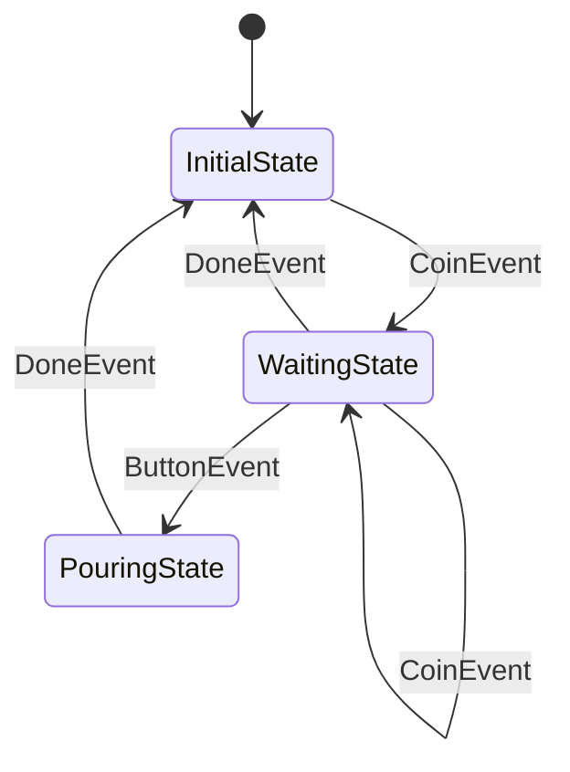

# kazura

[ **English** | [日本語](docs/README.ja.md) ]

Go library that simplifies difficult stateful application development with asynchronous processing, complex state transitions, and timeouts.

## Problem & Solution

Stateful applications with asynchronous processing, complex state transitions, and timeouts are notoriously difficult to develop correctly.

kazura provides:
- **Serializing async tasks through dispatchers** (eliminating race conditions)
- **Managing state transitions and timeouts in unified machines** (preventing timing issues)
- **Requiring predefined state graphs** (making runtime behavior predictable and debuggable)

This approach makes complex stateful logic simple to implement, test, and extend.

## Features

- **Task serialization** via dispatchers to eliminate race conditions in async processing
- **Unified state machines** that handle both transitions and timeouts consistently
- **Predefined state graphs** for predictable runtime behavior and easy debugging
- **State transition tracing** via pluggable `Tracer` for logging and debugging
- **Virtual time support** for deterministic testing of time-dependent logic
- **Panic-based utilities** for clear distinction between bugs and recoverable errors

## Installation

```bash
go get github.com/raiich/kazura
```

## Quick Start

Let's build a vending machine state machine using kazura. This example demonstrates major features of kazura.

### 1. State Graph Definition

Define states and their transitions first. This makes runtime behavior predictable and debuggable.

```go
import (
    "fmt"
    "log/slog"
    "time"

    "github.com/raiich/kazura/must"
    "github.com/raiich/kazura/state"
    "github.com/raiich/kazura/task"
    "github.com/raiich/kazura/task/eventloop"
)

// Type aliases for better readability
type State = state.State[*VendingMachine]
type Event = state.Event
type EntryMachine = state.EntryMachine[*VendingMachine]
type AfterFuncMachine = state.AfterFuncMachine[*VendingMachine]
type Transition = state.Transition[State]

// On creates the edge from one state to another for events of type E
func On[E Event](from, to State) state.Edge[State] {
    return state.On[State, E](from, to)
}

// Define the state graph
var stateGraph = must.Must(state.NewGraph[State](
    InitialState{},  // Initial state
    On[CoinEvent](InitialState{}, WaitingState{}),      // Coin insertion -> waiting
    On[CoinEvent](WaitingState{}, WaitingState{}),      // Additional coins
    On[DoneEvent](WaitingState{}, InitialState{}),      // Cancel/timeout
    On[*ButtonEvent](WaitingState{}, PouringState{}),   // Button press -> pouring
    On[DoneEvent](PouringState{}, InitialState{}),      // Pouring complete -> initial
))
```

State diagram:

```mermaid
stateDiagram-v2
  [*] --> InitialState
  InitialState --> WaitingState: CoinEvent
  PouringState --> InitialState: DoneEvent
  WaitingState --> InitialState: DoneEvent
  WaitingState --> PouringState: ButtonEvent
  WaitingState --> WaitingState: CoinEvent
```

### 2. State Implementation

Each state defines transition behavior in its `Entry` method.

`Entry` returns what the machine does next: `state.Trigger(event)` to process an event, `state.Stop()` to stop the machine, or `nil` to stay.

```go
// Initial state: machine is idle
type InitialState struct{}

func (s InitialState) Entry(machine *EntryMachine, event Event) state.Command {
    machine.Value().Coins = 0  // Reset coin count
    return nil
}

// Waiting state: accepts coins and item selection
type WaitingState struct{}

func (s WaitingState) Entry(machine *EntryMachine, event Event) state.Command {
    vendingMachine := machine.Value()

    // Handle coin events
    switch event.(type) {
    case CoinEvent:
        vendingMachine.Coins++
        slog.Info("coin", "count", vendingMachine.Coins)
    }

    // Guard conditions: conditionally control state transitions
    must.NoError(machine.OnExit(func(event Event) *state.Guarded {
        switch e := event.(type) {
        case *ButtonEvent:
            // Coffee requires 2 coins
            if e.Item == "coffee" && vendingMachine.Coins < 2 {
                return &state.Guarded{
                    Reason: fmt.Errorf("2 coin(s) for %v, but %d", e.Item, vendingMachine.Coins),
                }
            }
        }
        return nil  // Allow transition
    }))

    // Timeout handling: automatically return to initial state after 10 seconds
    must.NoError(machine.AfterFunc(vendingMachine.Dispatcher, 10*time.Second, func(machine *AfterFuncMachine) {
        must.NoError(machine.Trigger(DoneEvent("timeout")))
    }))
    return nil
}

// Pouring state: dispense the selected item
type PouringState struct{}

func (s PouringState) Entry(machine *EntryMachine, event Event) state.Command {
    slog.Info("pouring", "item", event.(*ButtonEvent).Item)

    // Pouring complete: the machine performs this transition once Entry returns
    return state.Trigger(DoneEvent("done"))
}
```

### 3. Events, State Data and Tracer Definition

```go
// Event type definitions
type CoinEvent int        // Coin insertion event
type ButtonEvent struct { // Button press event
    Item string
}
type DoneEvent string     // Completion/cancellation event

// State data
type VendingMachine struct {
    Coins      int
    Dispatcher task.Dispatcher
}

// transitionLogger logs every state transition via state.WithTracer
type transitionLogger struct{}

func (transitionLogger) Trace(t Transition) {
    slog.Info("transition", "from", fmt.Sprintf("%T", t.From), "to", fmt.Sprintf("%T", t.To), "event", t.Event)
}
```

### 4. State Machine Execution

```go
func main() {
    // Create event loop dispatcher
    baseTime := time.Now()
    dispatcher := eventloop.NewDispatcher(baseTime)

    // Create and launch state machine
    vendingMachine := &VendingMachine{
        Dispatcher: dispatcher,
    }
    machine := state.NewMachine(stateGraph, vendingMachine, state.WithTracer[State](transitionLogger{}))
    must.NoError(machine.Launch())

    // Scenario 1: Buy water (1 coin required)
    must.NoError(machine.Trigger(CoinEvent(1)))
    must.NoError(machine.Trigger(&ButtonEvent{Item: "water"}))

    // Scenario 2: Buy coffee (2 coins required)
    must.NoError(machine.Trigger(CoinEvent(1)))
    must.NoError(machine.Trigger(CoinEvent(2)))  // Additional coin
    must.NoError(machine.Trigger(&ButtonEvent{Item: "coffee"}))

    // Scenario 3: Insufficient coins for coffee (rejected by guard condition), then cancel
    must.NoError(machine.Trigger(CoinEvent(1)))
    err := machine.Trigger(&ButtonEvent{Item: "coffee"})  // Returns the *state.Guarded
    slog.Info("insufficient coins", "error", err)
    must.NoError(machine.Trigger(DoneEvent("cancel")))

    // Scenario 4: Timeout test (using virtual time)
    must.NoError(machine.Trigger(CoinEvent(1)))
    must.NoError(dispatcher.FastForward(baseTime.Add(10 * time.Second)))  // Simulate 10 seconds
}
```

### 5. Key kazura Features

This example demonstrates the following kazura features:

- **State Graph Definition**: Predefine state transitions with `state.NewGraph`
- **State Transition Control**: Implement transition behavior in each state's `Entry` method
- **Guard Conditions**: Control conditional state transitions with `OnExit`
- **Timeout Handling**: Time-based automatic transitions with `AfterFunc`
- **Chained Transitions**: Drive the next transition with the `state.Trigger` that `Entry` returns
- **Event Dispatching**: Event ordering control with `eventloop.Dispatcher`
- **Virtual Time**: Time control for testing with `FastForward`
- **State Transition Tracing**: Observe transitions via `state.WithTracer` for logging and debugging

See the code example at [examples/vending-machine](examples/vending-machine/main.go).

## Packages

- **`state/`** - State machines that unify transitions and timeout handling, eliminating timing issues
- **`task/`** - Dispatchers that serialize async tasks (queue, mutex, eventloop; pausable wraps one to pause its timers) to prevent race conditions
- **`must/`** - Panic-based utilities that distinguish programming bugs from recoverable errors

## Documentation

<!-- TODO -->

- [Best Practices](docs/state-machine-best-practices.md)

## License

See [LICENSE](LICENSE) file.
