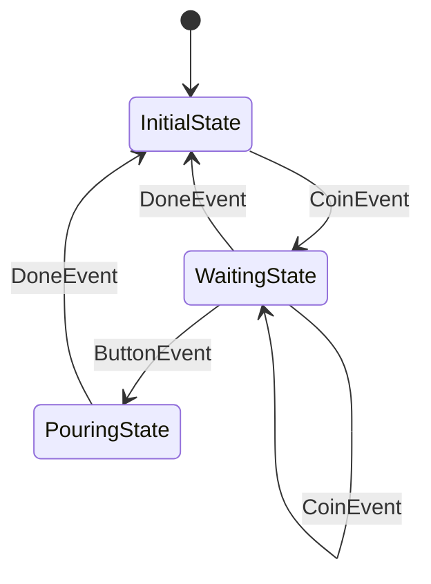

# kazura

[ [English](../README.md) | **日本語** ]

非同期処理、複雑な状態遷移、タイムアウトを伴う込み入ったステートフルアプリケーション開発を簡単にする Go ライブラリです。

## 課題と解決策

非同期処理、複雑な状態遷移、タイムアウトを伴うステートフルアプリケーションは、正しく開発することがとても大変です。

kazura は以下を提供します：
- **Dispatcher による非同期タスクの直列化**（競合状態の排除）
- **統一されたマシンでの状態遷移とタイムアウトの管理**（タイミング問題の防止）
- **事前定義された状態グラフの要求**（実行時の動作を予測可能かつデバッグ可能に）

このアプローチにより、複雑なステートフルロジックの実装、テスト、拡張が簡単になります。

## 特徴

- **タスクの直列化** - Dispatcher による非同期処理の競合状態排除
- **統一されたステートマシン** - 状態遷移とタイムアウトを一貫して処理
- **事前定義された状態グラフ** - 予測可能な実行時動作と容易なデバッグ
- **仮想時間のサポート** - 時間依存ロジックの決定論的テスト
- **パニックベースのユーティリティ** - バグと回復可能なエラーの明確な区別

## インストール

```bash
go get github.com/raiich/kazura
```

## クイックスタート

kazura を使って自動販売機のステートマシンを構築してみましょう。この例では kazura の主要機能を示します。

### 1. 状態グラフの定義

まず状態とその遷移を定義します。これにより実行時の動作が予測可能でデバッグしやすくなります。

```go
import (
    "github.com/raiich/kazura/state"
    "github.com/raiich/kazura/task/eventloop"
)

// 可読性向上のための型エイリアス
type State = state.State[*VendingMachine]
type Event = state.Event

// 状態グラフを定義
stateGraph := state.NewGraph[State](
    InitialState{},  // 初期状態
    On[CoinEvent](InitialState{}, WaitingState{}),      // コイン投入 -> 待機
    On[CoinEvent](WaitingState{}, WaitingState{}),      // 追加コイン
    On[DoneEvent](WaitingState{}, InitialState{}),      // キャンセル/タイムアウト
    On[*ButtonEvent](WaitingState{}, PouringState{}),   // ボタン押下 -> 注ぎ中
    On[DoneEvent](PouringState{}, InitialState{}),      // 注ぎ完了 -> 初期状態
)
```

状態図：


### 2. 状態の実装

各状態は `Entry` メソッドで遷移時の動作を定義します。

```go
// 初期状態：マシンはアイドル状態
type InitialState struct{}

func (s InitialState) Entry(machine *EntryMachine, event Event) {
    machine.Value().Coins = 0  // コイン数をリセット
}

// 待機状態：コインと商品選択を受け付ける
type WaitingState struct{}

func (s WaitingState) Entry(machine *EntryMachine, event Event) {
    vendingMachine := machine.Value()

    // コインイベントを処理
    switch event.(type) {
    case CoinEvent:
        vendingMachine.Coins++
        slog.Info("coin", "count", vendingMachine.Coins)
    }

    // ガード条件：状態遷移を条件付きで制御
    machine.OnExit(func(machine *ExitMachine, event Event) *state.Guarded {
        switch e := event.(type) {
        case *ButtonEvent:
            // コーヒーは2コイン必要
            if e.Item == "coffee" && vendingMachine.Coins < 2 {
                return &state.Guarded{
                    Reason: fmt.Errorf("2 coin(s) for %v, but %d", e.Item, vendingMachine.Coins),
                }
            }
        }
        return nil  // 遷移を許可
    })

    // タイムアウト処理：10秒後に自動的に初期状態へ戻る
    machine.AfterFunc(vendingMachine.Dispatcher, 10*time.Second, func(machine *AfterFuncMachine) {
        machine.Trigger(DoneEvent("timeout"))
    })
}

// 注ぎ状態：選択した商品を提供
type PouringState struct{}

func (s PouringState) Entry(machine *EntryMachine, event Event) {
    slog.Info("pouring", "item", event.(*ButtonEvent).Item)

    // 非同期処理：状態遷移後に実行
    machine.AfterEntry(func(machine *AfterEntryMachine) {
        // 注ぎ完了
        machine.Trigger(DoneEvent("done"))
    })
}
```

### 3. イベントと状態データの定義

```go
// イベント型の定義
type CoinEvent int        // コイン投入イベント
type ButtonEvent struct { // ボタン押下イベント
    Item string
}
type DoneEvent string     // 完了/キャンセルイベント

// 状態データ
type VendingMachine struct {
    Coins      int
    Dispatcher Dispatcher
}
```

### 4. ステートマシンの実行

```go
func main() {
    // イベントループの Dispatcher を作成
    dispatcher := eventloop.NewDispatcher(time.Now())

    // ステートマシンを作成して起動
    vendingMachine := &VendingMachine{
        Dispatcher: dispatcher,
    }
    machine := state.NewMachine(stateGraph, vendingMachine)
    machine.Launch()

    // シナリオ1：水を購入（1コイン必要）
    machine.Trigger(CoinEvent(1))
    machine.Trigger(&ButtonEvent{Item: "water"})

    // シナリオ2：コーヒーを購入（2コイン必要）
    machine.Trigger(CoinEvent(1))
    machine.Trigger(CoinEvent(2))  // 追加コイン
    machine.Trigger(&ButtonEvent{Item: "coffee"})

    // シナリオ3：コーヒーのコイン不足（ガード条件で拒否）
    machine.Trigger(CoinEvent(1))
    err := machine.Trigger(&ButtonEvent{Item: "coffee"})  // エラーを返す

    // シナリオ4：タイムアウトテスト（仮想時間を使用）
    machine.Trigger(CoinEvent(1))
    dispatcher.FastForward(time.Now().Add(10 * time.Second))  // 10秒をシミュレート
}
```

### 5. kazura の主要機能

この例では以下の kazura の機能を示しています：

- **状態グラフ定義** - `state.NewGraph` で状態遷移を事前定義
- **状態遷移制御** - 各状態の `Entry` メソッドで遷移時の動作を実装
- **ガード条件** - `OnExit` で条件付き状態遷移を制御
- **タイムアウト処理** - `AfterFunc` で時間ベースの自動遷移
- **非同期処理** - `AfterEntry` で遷移後の非同期処理
- **イベントディスパッチ** - `eventloop.Dispatcher` でイベントの順序制御
- **仮想時間** - `FastForward` でテスト用の時間制御

コード例は [examples/vending-machine](../examples/vending-machine/main.go) を参照してください。

## パッケージ

- **`state/`** - 状態遷移とタイムアウト処理を統一し、タイミング問題を排除するステートマシン
- **`task/`** - 非同期タスクを直列化する Dispatcher（queue、mutex、eventloop）で競合状態を防止
- **`must/`** - プログラミングバグと回復可能なエラーを区別するパニックベースのユーティリティ

## ドキュメント

TODO

- [Best Practices](state-machine-best-practices.md)

## ライセンス

[LICENSE](../LICENSE) ファイルを参照してください。
