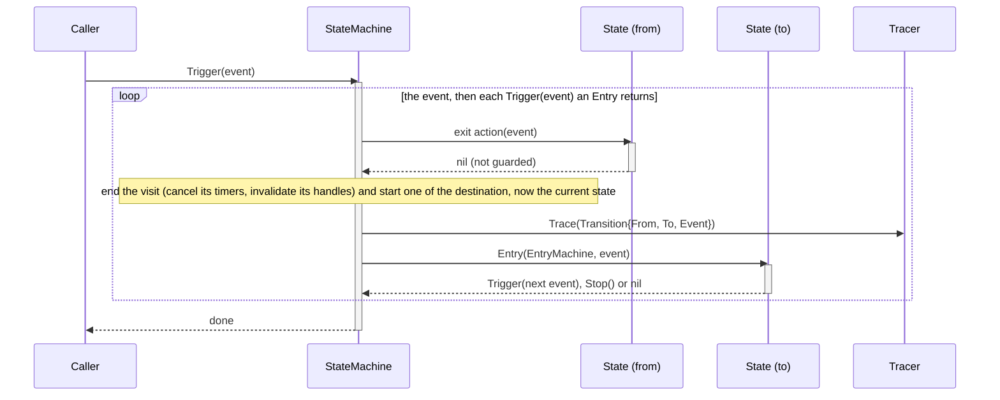

# How the event returned by Entry is processed

Entry runs inside a transition and cannot start another one, so it returns the
next event through state.Trigger and the machine processes it after Entry
returns. The loop ends when an Entry returns nil.

Launch enters the initial state through the same loop, starting at the Trace of
a Transition with a zero From.
