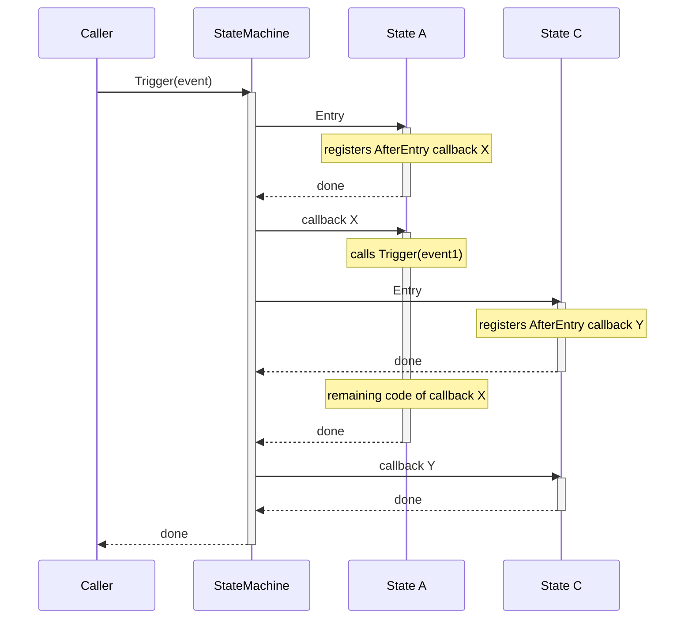
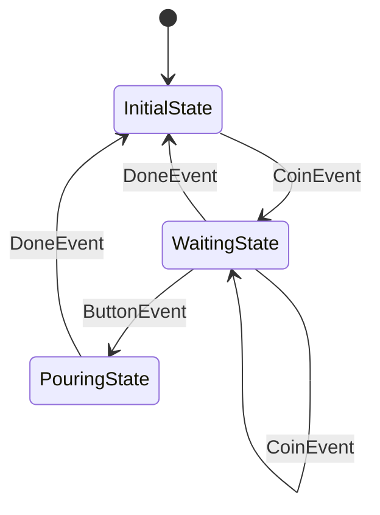
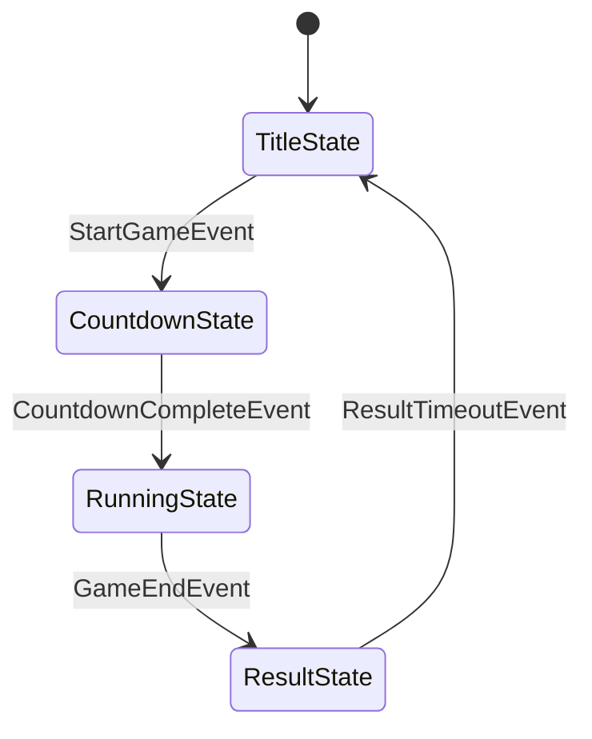
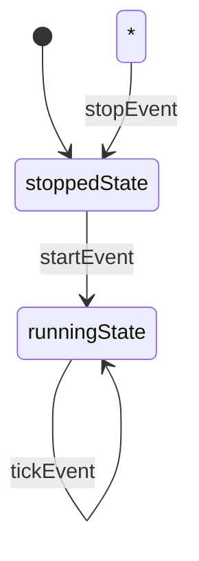

# kazura state.Machine Best Practices

This document summarizes best practices for effectively utilizing kazura's state.Machine.

## Overview

### What is state.Machine?

`state.Machine` is a Go library for implementing Finite State Machines (FSM). By explicitly managing state transitions,
it organizes complex state logic and achieves highly maintainable code.

### Key Benefits

- **Explicit State Transitions**: Defining state transitions as a graph structure enables visualization of system behavior
- **Type Safety**: Leverages Go generics for compile-time type checking
- **Testability**: Dispatcher abstraction makes time-dependent processing testable
- **Concurrency**: Dispatcher's synchronization guarantees ensure safety in multi-threaded environments

## Basic Usage

### Defining Type Aliases

Define project-specific type aliases to make the state machine easier to use.

```go
package main

import (
    "github.com/raiich/kazura/state"
    "github.com/raiich/kazura/task"
)

// Data type definition
type VendingMachine struct {
    Coins      int
    Dispatcher task.Dispatcher
}

// Type aliases (omit verbose type parameters)
type State = state.State[*VendingMachine]
type Event = state.Event

type EntryMachine = state.EntryMachine[*VendingMachine]
type ExitMachine = state.ExitMachine[*VendingMachine]
type AfterEntryMachine = state.AfterEntryMachine[*VendingMachine]
type AfterFuncMachine = state.AfterFuncMachine[*VendingMachine]

// On helper function (simplifies state transition definitions)
func On[E Event](from, to State) state.Edge[State] {
    return state.On[State, E](from, to)
}
```

**Key Points**:
- Pointer types (`*VendingMachine`) are recommended for data (to share data)
- Defining type aliases improves code readability
- The `On` helper function simplifies state transition definitions

### Creating a State Graph

Define state transitions as a graph.

```go
var stateGraph = must.Must(state.NewGraph[State](
    InitialState{},                                   // Initial state
    On[CoinEvent](InitialState{}, WaitingState{}),    // Coin insertion → waiting state
    On[CoinEvent](WaitingState{}, WaitingState{}),    // Additional coin during waiting
    On[*ButtonEvent](WaitingState{}, PouringState{}), // Button press → pouring state
    On[DoneEvent](PouringState{}, InitialState{}),    // Completion → initial state
    On[DoneEvent](WaitingState{}, InitialState{}),    // Cancel → initial state
))
```

**Key Points**:
- First argument is the initial state
- Use `On[EventType](from, to)` to define state transitions
- Self-transitions (loops) to the same state are possible
- `must.Must()` simplifies error handling (graph structure errors cause panic)

### Machine Initialization and Lifecycle

```go
func main() {
    // Create dispatcher (time management)
    dispatcher := eventloop.NewDispatcher(time.Now())

    // Initialize data
    vendingMachine := VendingMachine{
        Dispatcher: dispatcher,
    }

    // Create and launch machine
    machine := state.NewMachine(stateGraph, &vendingMachine)
    must.NoError(machine.Launch())

    // Trigger events
    must.NoError(machine.Trigger(CoinEvent(1)))
    must.NoError(machine.Trigger(&ButtonEvent{Item: "water"}))

    // Stop machine (if needed)
    must.NoError(machine.Stop())
}
```

**Lifecycle**:
1. `NewMachine()` - Create machine (not yet launched)
2. `Launch()` - Transition to initial state, execute Entry
3. `Trigger()` - State transitions via events
4. `Stop()` - Cancel all timers and stop

## State Implementation

### Basic State Definition

All states must implement the `State` interface.

```go
type InitialState struct{}

func (s InitialState) Entry(machine *EntryMachine, event Event) {
    // Processing when entering the state
    if event != nil {
        log.Info("enter InitialState", "event", event)
    }

    // Data initialization
    machine.Value().Coins = 0
}
```

**Key Points**:
- `Entry` method is called every time the state is entered
- `event` parameter is the triggered event (`nil` on Launch)
- Access data via `machine.Value()`

### State Interface Customization (Optional)

The standard kazura `State` interface can be extended by adding application-specific methods.

When integrating with game engines, add per-frame processing methods.

```go
type State interface {
    state.State[*Data]  // Entry method
    HandleInput(sc *Scene, input ui.Input)
    Draw(sc *Scene, screen *ebiten.Image)
}

type RunningState struct{}

func (s RunningState) Entry(machine *state.EntryMachine[*Data], event state.Event) {
    // State initialization
}

func (s RunningState) HandleInput(sc *Scene, input ui.Input) {
    // Input processing
}

func (s RunningState) Draw(sc *Scene, screen *ebiten.Image) {
    // Drawing processing
}
```

**Important Notes**:
- Custom methods must be implemented for **all states**
- The standard `Entry` method is required

## Event Design

### Basic Event Definitions

Events can be defined using any type.

```go
// Simple event (no data)
type CoinEvent int

// Struct event (with data)
type ButtonEvent struct {
    Item string
}

// String event
type DoneEvent string
```

**Usage**:
- No data needed: Empty struct `struct{}` or int/string
- Data needed: Use struct
- Pointer type events: When distinction is needed in state transition graph (`*ButtonEvent` vs `ButtonEvent`)

### Triggering Events

```go
// Value type events
must.NoError(machine.Trigger(CoinEvent(1)))
must.NoError(machine.Trigger(DoneEvent("timeout")))

// Pointer type events
must.NoError(machine.Trigger(&ButtonEvent{Item: "coffee"}))
```

### Wildcard Transitions

By setting `from` to `nil`, you can define transitions from any state.

```go
var stateGraph = must.Must(state.NewGraph[State](
    InitialState{},
    On[QuitEvent](nil, InitialState{}), // Quit → initial state from any state
    // ...
))
```

**Use Cases**:
- Error handling (from any state to error state)
- Reset functionality (from any state to initial state)
- Global event processing

## Timers and Asynchronous Processing

### Delayed Execution with AfterFunc

Use timers to automatically trigger events after a specified duration.

```go
func (s WaitingState) Entry(machine *EntryMachine, event Event) {
    vendingMachine := machine.Value()

    // Trigger timeout event after 10 seconds
    machine.AfterFunc(vendingMachine.Dispatcher, 10*time.Second, func(machine *AfterFuncMachine) {
        must.NoError(machine.Trigger(DoneEvent("timeout")))
    })
}
```

**Features**:
- When state transitions occur, timers registered in that state are automatically canceled
- Synchronization is guaranteed via `Dispatcher` (safe for concurrent processing)
- In tests, you can advance time with `Dispatcher.FastForward()`

### Immediate Post-Processing with AfterEntry

Register processing to execute immediately after the Entry method.

```go
func (s PouringState) Entry(machine *EntryMachine, event state.Event) {
    log.Info("pouring", "item", event.(*ButtonEvent).Item)

    must.NoError(machine.AfterEntry(func(machine *AfterEntryMachine) {
        // Executed immediately after Entry completes
        must.NoError(machine.Trigger(DoneEvent("done")))
    }))
}
```

**Use Cases**:
- When you want to transition to the next state immediately after Entry initialization
- Use AfterEntry because calling `Trigger` directly within Entry causes re-entry issues

#### Execution Order in Chained Transitions

When an AfterEntry callback calls `Trigger`, the destination state's Entry executes immediately, but its AfterEntry callback does not run right away. Instead, it runs after the current AfterEntry callback finishes.

Example: State A → State B → State C, where each transition is driven by AfterEntry:

```
1. State A: Entry              — registers AfterEntry callback X
2. callback X runs             — calls Trigger(event1)
3.   State B: Exit → State C: Entry   — registers AfterEntry callback Y
4.   callback X continues      — remaining code after Trigger(event1)
5. callback Y runs             — State C's AfterEntry
```

Between State C's Entry (step 3) and its AfterEntry callback Y (step 5), the remaining code of callback X (step 4) runs.



**Key Point**: If your AfterEntry callback has no code after the `Trigger` call (which is the typical pattern), this ordering has no practical effect. It only matters if you have logic after `Trigger` in the same callback.

### Dispatcher Selection

Choose a Dispatcher based on your state machine use case.

```go
// When you want to control time (games, animation, tests)
dispatcher := eventloop.NewDispatcher(time.Now())
must.NoError(dispatcher.FastForward(time.Now())) // Call every frame

// For real-time concurrent processing
dispatcher := mutex.NewDispatcher()
// or
dispatcher := queue.NewDispatcher(ctx)
```

**Selection Criteria**:
- **eventloop**: When you have a periodic update loop (like games) and want manual time control (advance time with `FastForward()`). Also useful for tests.
- **mutex/queue**: For real-time concurrent processing

**Dispatcher Feature Comparison**:

| Dispatcher | Time Control            | Execution Method              | Use Case                 |
|------------|-------------------------|-------------------------------|--------------------------|
| eventloop  | Manual (FastForward)    | Caller goroutine              | Game loops, tests        |
| queue      | Real-time (time.AfterFunc) | Separate goroutine (Serve) | Web servers, workers     |
| mutex      | Real-time (time.AfterFunc) | Caller goroutine (sync)    | Simple concurrent processing |

## Guard Conditions

### Guards with OnExit

Perform validation before exiting a state and block transitions if conditions are not met.

```go
func (s WaitingState) Entry(machine *EntryMachine, event Event) {
    vendingMachine := machine.Value()

    // Validation when exiting state
    must.NoError(machine.OnExit(func(machine *ExitMachine, event state.Event) *state.Guarded {
        switch e := event.(type) {
        case CoinEvent:
            return nil // Always allow coin insertion
        case *ButtonEvent:
            // Coffee requires 2 coins
            if e.Item == "coffee" && vendingMachine.Coins < 2 {
                return Guarded("2 coin(s) for %v, but %d", e.Item, vendingMachine.Coins)
            }
        }
        return nil
    }))
}

// Helper function
func Guarded(format string, args ...any) *state.Guarded {
    return &state.Guarded{
        Reason: fmt.Errorf(format, args...),
    }
}
```

**Usage Example**:
```go
// Successful transition
must.NoError(machine.Trigger(CoinEvent(1)))
must.NoError(machine.Trigger(CoinEvent(2)))
must.NoError(machine.Trigger(&ButtonEvent{Item: "coffee"}))

// Failed transition (returns error)
must.NoError(machine.Trigger(CoinEvent(1)))
err := machine.Trigger(&ButtonEvent{Item: "coffee"})
// err: "2 coin(s) for coffee, but 1"
```

**Key Points**:
- `OnExit` is registered in each Entry and executed when exiting that state
- Returning `*state.Guarded` blocks the state transition and returns an error
- Returning `nil` allows the transition

## Architecture Patterns

### Gateway Struct Pattern

When utilizing state machines, we recommend the pattern of **having a gateway struct with `*Data` (embedded) and `machine` (private)**.

```go
type Scene struct {
    *Data                              // Embedded for direct access
    machine *state.Machine[State, *Data]  // Private to hide details
}

func NewScene() *Scene {
    data := &Data{...}
    machine := state.NewMachine(stateGraph, data)
    must.NoError(machine.Launch())
    return &Scene{Data: data, machine: machine}
}
```

**Benefits**:
- **Encapsulation**: Hide state machine details from external access
- **Concise Access**: `s.GameData.Laps` (without embedding: `s.Data.GameData.Laps`)
- **Controlled Operations**: Operate state machine only through public methods

**Difference from vending-machine**: vending-machine manages directly for educational simplicity, but for actual applications, the gateway struct pattern is recommended.

### Nested State Machines

For complex systems, arrange multiple state machines hierarchically.

```go
// Scene layer definition
type Scene struct {
    *Data
    machine *state.Machine[State, *Data]
}

type Data struct {
    Character *character.Character  // Character layer definition
    GameData  GameData
}
```

```go
// Character layer definition
// package character
type Character struct {
    *Data
    machine *state.Machine[State, *Data]
}

type Data struct {
    X int
    Y int
}
```

**State Independence**:
- Scene state machine: Title, Countdown, Running, Result
- Character state machine: Stopped, Running (animation control)

**Coordination**:
```go
func (s RunningState) Entry(machine *EntryMachine, event Event) {
    data := machine.Value()

    // Launch Character state machine
    must.NoError(data.Character.Ready())
}
```

### Multiple State Machine Coordination

Each state machine operates independently while coordinating through method calls.

```go
// Scene → Character
func (s RunningState) HandleInput(sc *Scene, input ui.Input) {
    sc.Character.Kick()  // Call Character method
}
```

```go
// Character public methods
func (c *Character) Kick() {
    c.Speed = c.Config.SpeedMax
}

func (c *Character) Ready() error {
    return c.machine.Trigger(startEvent{})  // Internal state machine event
}

func (c *Character) Stop() error {
    return c.machine.Trigger(stopEvent{})
}
```

**Key Points**:
- Hide state machine details from external access (encapsulation)
- Communicate between state machines through public methods
- Each state machine can be tested independently

## Implementation Examples

### Example 1: Vending Machine (vending-machine)

**State Transition Diagram**:


**Features**:
- Guard conditions: Block purchase with insufficient funds
- Timeout: Auto-reset after 10 seconds of inactivity (DoneEvent)
- Self-transition: Additional coins in WaitingState (CoinEvent)

### Example 2: Game (the-way)

**Scene State Machine**:



**Character State Machine (Animation)**:



**Features**:
- Nested state machines: 2-layer structure of Scene and Character
- Auto-transition: Automatic transition from Result to Title after time elapsed
- Game loop: Call `Dispatcher.FastForward()` every frame

## Hints

### Recommended Patterns

1. **Use Gateway Struct Pattern**: Encapsulate with `*Data` embedding + private `machine`
2. **Leverage Type Aliases**: Clarify type definitions
3. **Split by State into Files/Packages**: Improve readability in large projects
4. **Clarify Responsibilities**: Separate data roles and define state machine scope
5. **Utilize Nested Structures**: Build complex systems through hierarchies
6. **Validate with Guard Conditions**: Prevent invalid state transitions
7. **Use Timers via Dispatcher**: Ensure concurrency safety

### Common Mistakes

1. **Direct Trigger in Entry**: Use `AfterEntry` instead of calling `Trigger` directly
2. **Timers without Dispatcher**: Use `machine.AfterFunc` instead of `time.AfterFunc`
3. **Forgetting OnExit Registration**: Don't forget to register guard conditions in `Entry`
4. **Missing State Transition Graph Definitions**: Explicitly define all transitions
5. **State Explosion**: Consider hierarchies when there are too many states

### When to Use State Machines

- When you need **multiple states with complex transition rules** and **time-based auto-transitions** (timeouts)

### Avoiding State Explosion

Solutions when state count grows too large:

1. **Hierarchies**: Use nested state machines (Scene and Character layer examples)
2. **State Consolidation**: Consolidate similar-behaving states and distinguish by data

### References

- [vending-machine implementation example](../examples/vending-machine/)
